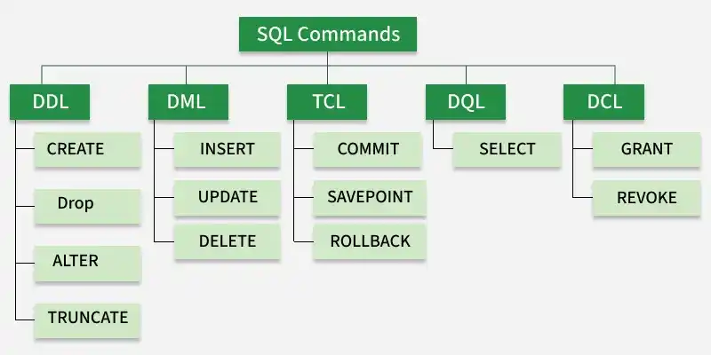

<h1 align="center">SQL Notes</h2>


- [1. Introduction:](#1-introduction)
- [2. DDL:](#2-ddl)
  - [2.1. CREATE:](#21-create)
    - [2.1.1. CREATE DATABASE:](#211-create-database)
    - [2.1.2. CREATE TABLE:](#212-create-table)
      - [2.1.2.1. Schema:](#2121-schema)
        - [2.1.2.1.1. Common SQL Data Types For Schema:](#21211-common-sql-data-types-for-schema)
        - [2.1.2.1.2. Common SQL Constraints For Schema:](#21212-common-sql-constraints-for-schema)
  - [2.2. ALTER:](#22-alter)
    - [Database Level:](#database-level)
    - [Table Level:](#table-level)
    - [Column Level:](#column-level)
  - [2.3. DROP:](#23-drop)
  - [2.4. TRUNCATE:](#24-truncate)
  - [2.5. RENAME:](#25-rename)
- [3. DML:](#3-dml)
- [4. DQL:](#4-dql)
- [5. DCL:](#5-dcl)
- [6. TCL:](#6-tcl)


# 1. Introduction: 
SQL (Structured Query Language) is a standardized language for all relational databases management systems. Every RDBMS, such as MySQL and PostgreSQL etc, uses SQL as its primary language and add extra specific features on it. There are 5 main categories of SQL Commands: 

| Category | Full Form                    | commands                                               | Purpose                                                       |
| -------- | ---------------------------- | ------------------------------------------------------ | ------------------------------------------------------------- |
| DDL      | Data Definition Language     | `CREATE, ALTER, DROP, TRUNCATE, RENAME`                | Define and modify database structure (e.g. databases, tables) |
| DML      | Data Manipulation Language   | `INSERT, UPDATE, DELETE`                               | Insert, update, and delete data form tables                   |
| DQL      | Data Query Language          | `SELECT`                                               | Retrieve data from tables                                     |
| DCL      | Data Control Language        | `GRANT, REVOKE`                                        | Control permissions and access                                |
| TCL      | Transaction Control Language | `BEGIN/START TRANSACTION, COMMIT, ROLLBACK, SAVEPOINT` | Manage transactions                                           |



**Note:** SQL is a query language and cannot run independently. It requires a DBMS specifically RDBMS, such as MySQL or PostgreSQL etc to run.

# 2. DDL: 
DDL (Data Definition Language) is a category of SQL commands used to define, create, modify, and remove database structures such as databases, tables etc.

## 2.1. CREATE:
The `CREATE` command used to create new databases or tables.

### 2.1.1. CREATE DATABASE:
The `CREATE DATABASE` command used to create new databases.

```sql
CREATE DATABASE database_name;
```

### 2.1.2. CREATE TABLE:
The `CREATE TABLE` command used to create new tables.

```sql
CREATE TABLE table_name (
    .....schema.....
    .....schema.....
    .....schema.....
);
```

**Note:** For preventing duplicate table name, use `IF NOT EXISTS` clause.

```sql
CREATE TABLE IF NOT EXISTS table_name (
    .....schema.....
    .....schema.....
    .....schema.....
)
```

#### 2.1.2.1. Schema: 
A schema defines the structure of a table, including:
- Column names
- Data types
- Constraints
- Relationships

```sql
CREATE TABLE IF NOT EXISTS table_name (
    column_name data_type constraints,
    column_name data_type constraints,
);
```

Example:

```sql
CREATE TABLE users (
    id INTEGER GENERATED ALWAYS AS IDENTITY PRIMARY KEY,
    -- id SERIAL PRIMARY KEY, -- only works on PostgreSQL
    -- id INT AUTO_INCREMENT PRIMARY KEY, -- only works on MySQL
    name VARCHAR(100) NOT NULL,
    email VARCHAR(255) UNIQUE NOT NULL
);
```

```sql
CREATE TABLE meals (
    id INTEGER GENERATED ALWAYS AS IDENTITY PRIMARY KEY,
    -- id SERIAL PRIMARY KEY, -- only works on PostgreSQL
    -- id INT AUTO_INCREMENT PRIMARY KEY, -- only works on MySQL
    title VARCHAR(255) NOT NULL,
    price DECIMAL(10,2) NOT NULL
);
```

```sql
CREATE TABLE orders (
    id INTEGER GENERATED ALWAYS AS IDENTITY PRIMARY KEY,
    -- id SERIAL PRIMARY KEY, -- only works on PostgreSQL
    -- id INT AUTO_INCREMENT PRIMARY KEY, -- only works on MySQL
    user_id INT REFERENCES users(id),
    meal_id INT REFERENCES meals(id),
    quantity INT DEFAULT 1
);
```


##### 2.1.2.1.1. Common SQL Data Types For Schema: 

- Numeric types:

| Type                        | Description                                          | Example                                  |
| --------------------------- | ---------------------------------------------------- | ---------------------------------------- |
| `SMALLINT`                  | 2 bytes (Small integer values)                       | age, quantity                            |
| `INT/INTEGER`               | 4 bytes (Standard integer values)                    | default choice                           |
| `BIGINT`                    | 8 bytes (Very large integer values)                  | large counters when overflow is possible |
| `NUMERIC(p,s)/DECIMAL(p,s)` | variable (Exact numeric values with fixed precision) | money or financial data                  |
| `REAL`                      | 4 bytes (6 decimal digits precision)                 | approximate scientific data only         |
| `DOUBLE PRECISION`          | 8 Bytes (15 decimal digits precision)                | approximate scientific data only         |


```sql
CREATE TABLE IF NOT EXISTS numeric_types_demo (
    id INTEGER GENERATED ALWAYS AS IDENTITY PRIMARY KEY,
    -- id SERIAL PRIMARY KEY, -- only works on PostgreSQL
    -- id INT AUTO_INCREMENT PRIMARY KEY, -- only works on MySQL

    small_number SMALLINT,                      -- 10, -5, 300
    normal_number INT,                          -- 1000, 250000
    big_number BIGINT,                          -- 10000000000

    exact_money NUMERIC(10,2),                  -- 10.00, 10.99
    exact_precise DECIMAL(10,6),                -- 10.123456

    approx_real REAL,                           -- 10.123457 (rounded after 6 digits)
    approx_double DOUBLE PRECISION,             -- 10.123456789123457 (rounded after 15 digits)
);
```

Note: For `NUMERIC(p,s)/DECIMAL(p,s)`
- Precision = Total number of digits allowed.
- Scale = Number of digits allowed after the decimal point.

SO NUMERIC(10,2) means it precision is total 10 digit (before 8 and after 2): 

```js
12345678.90   ✅ (8 before, 2 after)
1.23          ✅ (okay)
-99999999.99  ✅ (min)
99999999.99   ✅ (max)

123456789.12  ❌ (9 digits before → too big)
12.123        ❌ (3 decimal places → too many)
```

- String types:

| Type         | Description                                   | Example                   |
| ------------ | --------------------------------------------- | ------------------------- |
| `CHAR(n)`    | Fixed n length of string (padded with spaces) | country code, status code |
| `VARCHAR(n)` | Variable n length string with limit           | names, titles             |
| `TEXT`       | Variable-length string                        | descriptions, content     |

Note: There is no performance difference between `TEXT` and `VARCHAR` in PostgreSQL. The Only Real Difference `VARCHAR(n)` adds a constraint.

```sql
CREATE TABLE IF NOT EXISTS string_types_demo (
    id INTEGER GENERATED ALWAYS AS IDENTITY PRIMARY KEY,
    -- id SERIAL PRIMARY KEY, -- only works on PostgreSQL
    -- id INT AUTO_INCREMENT PRIMARY KEY, -- only works on MySQL

    fixed_char CHAR(5),                            -- 'A    ', 'BD   ' (padded)
    short_text VARCHAR(50),                        -- 'Hello World'
    long_text TEXT                                 -- large content
);
```

- Date & Time types:

| Type        | Description                         | Example                            |
| ----------- | ----------------------------------- | ---------------------------------- |
| `DATE`      | Date only                           | `'2026-04-13'`                     |
| `TIME`      | Time only                           | `'14:30:00'`                       |
| `TIMESTAMP` | Date + time (no timezone)           | `'2026-04-13 14:30:00'`            |
| `INTERVAL`  | Duration / difference between times | `'2 days'`, `'3 hours 30 minutes'` |

```sql
CREATE TABLE IF NOT EXISTS datetime_types_demo (
    id INTEGER GENERATED ALWAYS AS IDENTITY PRIMARY KEY,
    -- id SERIAL PRIMARY KEY, -- only works on PostgreSQL
    -- id INT AUTO_INCREMENT PRIMARY KEY, -- only works on MySQL


    only_date DATE,                                 -- '2026-04-13'
    only_time TIME,                                 -- '14:30:00'

    simple_timestamp TIMESTAMP,                     -- '2026-04-13 14:30:00'

    duration INTERVAL                               -- '2 days', '3 hours'
);
```

-  Boolean Types: 
  
| Type           | Description          | Example   |
| -------------- | -------------------- | --------- |
| `BOOLEAN/BOOL` | true, false and null | is_active |


```sql
-- ENUM must be created first
CREATE TYPE order_status AS ENUM ('pending', 'completed', 'cancelled');

CREATE TABLE IF NOT EXISTS other_types_demo (
    id INTEGER GENERATED ALWAYS AS IDENTITY PRIMARY KEY,
    -- id SERIAL PRIMARY KEY, -- only works on PostgreSQL
    -- id INT AUTO_INCREMENT PRIMARY KEY, -- only works on MySQL

    is_active BOOLEAN,                              -- true / false
);
```


##### 2.1.2.1.2. Common SQL Constraints For Schema:

| Constraint    | Description                         | Example                     |
| ------------- | ----------------------------------- | --------------------------- |
| `NOT NULL`    | Prevent empty values                | username, email             |
| `UNIQUE`      | Prevent duplicate values            | email, username             |
| `PRIMARY KEY` | Unique identifier for each row      | id                          |
| `FOREIGN KEY` | Creates relationship between tables |                             |
| `CHECK`       | Validates data against a condition  | age must be greater than 18 |
| `DEFAULT`     | Sets default value                  | default choice              |

- NOT NULL: 
  
```sql
CREATE TABLE users (
    id INTEGER GENERATED ALWAYS AS IDENTITY PRIMARY KEY,
    -- id SERIAL PRIMARY KEY, -- only works on PostgreSQL
    -- id INT AUTO_INCREMENT PRIMARY KEY, -- only works on MySQL

    name VARCHAR(100) NOT NULL,
    email VARCHAR(255) NOT NULL
);
``` 

- UNIQUE: 
  
```sql
CREATE TABLE users (
    id INTEGER GENERATED ALWAYS AS IDENTITY PRIMARY KEY,
    -- id SERIAL PRIMARY KEY, -- only works on PostgreSQL
    -- id INT AUTO_INCREMENT PRIMARY KEY, -- only works on MySQL

    email VARCHAR(255) UNIQUE
);
```

- PRIMARY KEY: 

```sql
CREATE TABLE users (
    id INTEGER GENERATED ALWAYS AS IDENTITY PRIMARY KEY,
    -- id SERIAL PRIMARY KEY, -- only works on PostgreSQL
    -- id INT AUTO_INCREMENT PRIMARY KEY, -- only works on MySQL

    id INT PRIMARY KEY,
    email VARCHAR(255)
);
```

- FOREIGN KEY: 

```sql
CREATE TABLE IF NOT EXISTS users (
    id INTEGER GENERATED ALWAYS AS IDENTITY PRIMARY KEY,
    -- id SERIAL PRIMARY KEY, -- only works on PostgreSQL
    -- id INT AUTO_INCREMENT PRIMARY KEY, -- only works on MySQL

    name VARCHAR(100) NOT NULL,
);

CREATE TABLE IF NOT EXISTS orders (
    id INTEGER GENERATED ALWAYS AS IDENTITY PRIMARY KEY,
    -- id SERIAL PRIMARY KEY, -- only works on PostgreSQL
    -- id INT AUTO_INCREMENT PRIMARY KEY, -- only works on MySQL

    user_id INTEGER,
    FOREIGN KEY (user_id) REFERENCES users(id)

    -- or
    user_id INT REFERENCES users(id) // shorthand
);
``` 


- CHECK:

```sql
CREATE TABLE products (
    id INTEGER GENERATED ALWAYS AS IDENTITY PRIMARY KEY,
    -- id SERIAL PRIMARY KEY, -- only works on PostgreSQL
    -- id INT AUTO_INCREMENT PRIMARY KEY, -- only works on MySQL

    price DECIMAL(10,2) CHECK (price > 0),
    stock INTEGER CHECK (stock >= 0)
);
```

- DEFAULT: 

```sql
CREATE TABLE users (
        id INTEGER GENERATED ALWAYS AS IDENTITY PRIMARY KEY,
    -- id SERIAL PRIMARY KEY, -- only works on PostgreSQL
    -- id INT AUTO_INCREMENT PRIMARY KEY, -- only works on MySQL

    is_active BOOLEAN DEFAULT TRUE,
    created_at TIMESTAMP DEFAULT CURRENT_TIMESTAMP
);
```

## 2.2. ALTER:
The `ALTER` command used to modify existing databases, tables and columns.

syntax: 
```sql
ALTER TABLE table_name
action;
```

### Database Level:

- Rename database:

```sql
ALTER DATABASE old_database_name RENAME TO new_database_name;
```

### Table Level:

- Rename table: 

```sql
ALTER TABLE old_table_name RENAME TO new_table_name;
```

- Add Constraints:

```sql
ALTER TABLE table_name
ADD constraints new_column_name UNIQUE (old_column_name);
```

```sql
ALTER TABLE table_name
ADD constraints new_column_name CHECK (old_column_name > 0);s
```

- Remove Constraints:

```sql
ALTER TABLE table_name
DROP CONSTRAINT column_name;
```

### Column Level: 
- Add column: 

```sql
ALTER TABLE table_name
ADD column_name data_type constraints;
```

- Drop column: 

```sql
ALTER TABLE table_name
DROP COLUMN column_name;
```

- Modify column data types:

```sql
ALTER TABLE users
ALTER COLUMN column_name TYPE new_data_type;
```

- Rename column:

```sql
ALTER TABLE table_name
RENAME COLUMN old_column_name TO new_column_name;
```

- Add/remove constraints:

```sql
ALTER TABLE users
ALTER COLUMN column_name SET constraints;
```

```sql
ALTER TABLE users
ALTER COLUMN column_name DROP constraints;
```


## 2.3. DROP:
The `DROP` command used to remove existing databases or tables.

```sql
DROP DATABASE database_name;
```

```sql
DROP TABLE table_name;
```


## 2.4. TRUNCATE:
The `TRUNCATE` command used to remove existing databases or tables.

```sql
TRUNCATE DATABASE database_name;
```

```sql
TRUNCATE TABLE table_name;
```

Note: `DROP` and `TRUNCATE` are different. `DROP` removes the database or table completely, while `TRUNCATE` removes the data from the table, but leaves the table structure in place.

## 2.5. RENAME:
The `RENAME` command used to rename existing databases or tables.

```sql
RENAME DATABASE database_name TO new_database_name;
```

```sql
RENAME TABLE table_name TO new_table_name;
```


# 3. DML: 
# 4. DQL:
# 5. DCL:
# 6. TCL: